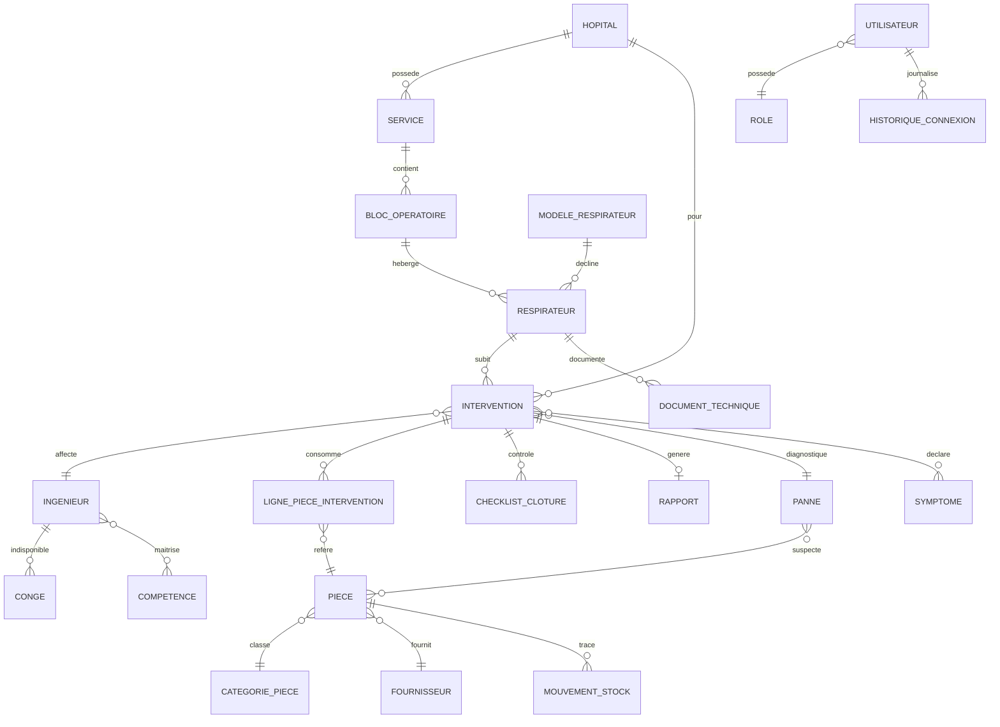

# Modèle de données — GMAO Datex-Ohmeda (SQLite / EF Core)

## 1. Entités principales

| Entité | Description |
|---|---|
| `Utilisateur` | Compte (login, mot de passe haché, rôle, état) |
| `Role` | Rôle RBAC (Administrateur, ResponsableSAV, Ingenieur, Technicien, Client, Invite) |
| `HistoriqueConnexion` | Journal des connexions (date, IP, succès) |
| `Hopital` | Client (nom, ville, adresse, contact) |
| `Service` | Service hospitalier rattaché à un hôpital |
| `BlocOperatoire` | Bloc rattaché à un service |
| `Respirateur` | Équipement Datex-Ohmeda (parc) |
| `ModeleRespirateur` | Modèle/gamme (Aespire, Avance, Aisys…) |
| `DocumentTechnique` | Manuel, schéma, procédure (PDF) lié à un modèle/respirateur |
| `Intervention` | Demande/intervention de maintenance corrective (DI) |
| `Symptome` | Symptôme prédéfini déclarable |
| `Panne` | Type de panne / défaillance catalogué |
| `CheckListClôture` | Lignes de contrôle obligatoires d'une intervention |
| `Piece` | Pièce détachée (stock) |
| `CategoriePiece` | Catégorie de pièce |
| `Fournisseur` | Fournisseur de pièces |
| `LignePieceIntervention` | Pièces consommées lors d'une intervention |
| `PanneePiece` | Association panne ↔ pièces probables |
| `Ingenieur` | Profil technique (compétences, zone, planning) |
| `Conge` | Période d'indisponibilité d'un ingénieur |
| `Competence` | Compétence (modèle maîtrisé) |
| `Rapport` | Rapport PDF généré et archivé |
| `PhotoDocument` | Pièce jointe (photo/vidéo/doc) polymorphe |
| `MouvementStock` | Entrée/sortie de stock pièce |
| `Notification` | Notification émise (type, cible, lu) |

## 2. Énumérations

```
RoleType        : Administrateur, ResponsableSAV, Ingenieur, Technicien, Client, Invite
EtatRespirateur : EnService, EnMaintenance, HorsService, EnAttente
EtatIntervention: Nouvelle, Affectee, EnDeplacement, Diagnostic, Reparation,
                  EnAttentePiece, Test, Validation, Cloturee, Annulee
Priorite        : Basse, Normale, Haute, Critique
TypeDocument    : ManuelUtilisateur, ManuelMaintenance, Schema, Procedure, Calibration, GuideSAV, Photo, Autre
TypeNotification: NouvelleDI, InterventionUrgente, PieceIndisponible, StockFaible,
                  RespirateurCritique, FinIntervention, TempsDepasse
TypeMouvement   : Entree, Sortie, Ajustement
```

## 3. Relations clés

- `Hopital 1—* Service 1—* BlocOperatoire 1—* Respirateur`
- `ModeleRespirateur 1—* Respirateur`
- `Respirateur 1—* Intervention`
- `Intervention *—1 Ingenieur` (affecté) · `Intervention *—1 Hopital`
- `Intervention 1—* LignePieceIntervention *—1 Piece`
- `Intervention 1—* CheckListClôture`
- `Intervention 1—1 Rapport` (à la clôture)
- `Intervention *—* Symptome` (déclarés) · `Intervention *—1 Panne` (diagnostiquée)
- `Panne *—* Piece` via `PanneePiece`
- `Piece *—1 CategoriePiece` · `Piece *—1 Fournisseur` · `Piece 1—* MouvementStock`
- `Ingenieur 1—* Conge` · `Ingenieur *—* Competence` · `Ingenieur *—* ModeleRespirateur` (zone/compétence)
- `Respirateur 1—* DocumentTechnique` · `* PhotoDocument` (polymorphe via OwnerType/OwnerId)
- `Utilisateur *—1 Role` · `Utilisateur 1—* HistoriqueConnexion`

## 4. Diagramme entité-relation (Mermaid)



## 5. Conventions de schéma

- Clés primaires : `Id` (INTEGER, autoincrément) ou `Guid` selon entité référencée par QR.
- Champs d'audit communs (classe de base `EntiteBase`) : `Id`, `DateCreation`, `DateModification`, `CreePar`, `ModifiePar`.
- Soft-delete optionnel via `EstSupprime` (filtre global EF).
- Index : `Respirateur.NumeroSerie` (unique), `Respirateur.CodeQr` (unique), `Intervention.NumeroDI` (unique), `Piece.Reference` (unique).
- Stockage des pièces jointes : chemin de fichier (`assets/uploads/...`) + métadonnées en base (pas de BLOB volumineux).

## 6. Champs de calcul KPI (vues/agrégations)

- **MTTR** = moyenne(`TempsReparation` + `TempsDeplacement`) sur interventions clôturées.
- **MTBF** par respirateur = (temps de service cumulé) / (nombre de pannes).
- **Disponibilité** = (temps total − temps d'arrêt) / temps total.
- **Coût intervention** = main d'œuvre + Σ(pièces × prix).
- Ces calculs sont exposés par `IKpiService` (Application) et alimentent LiveCharts2.
