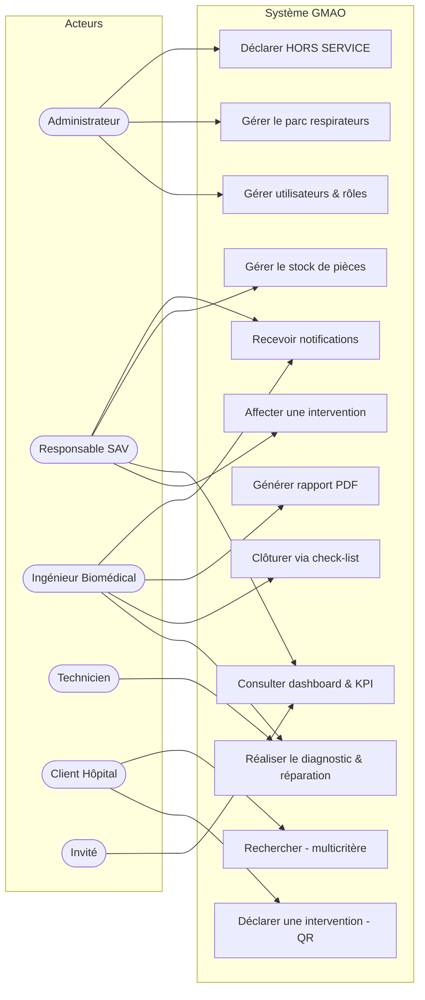
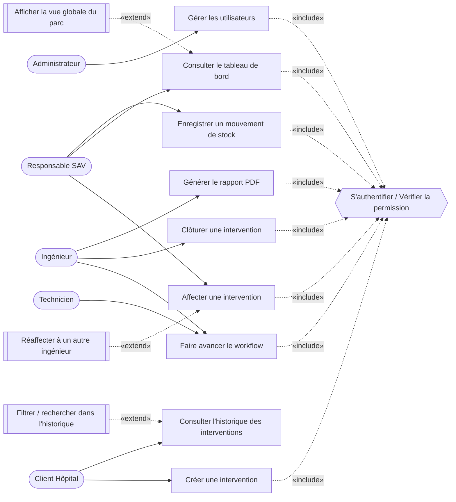
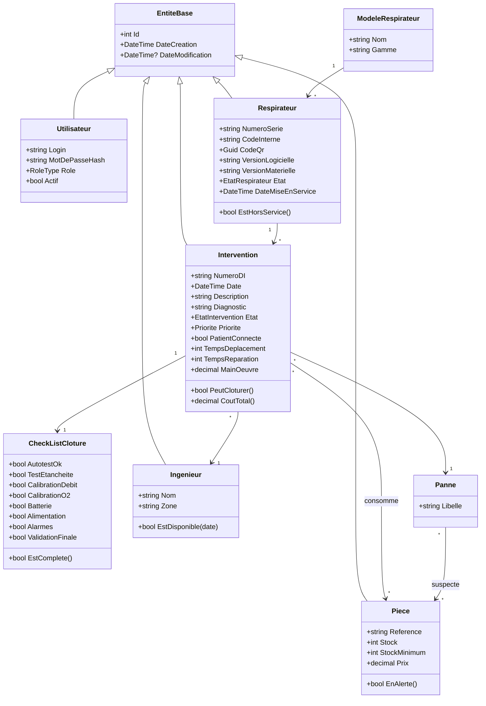
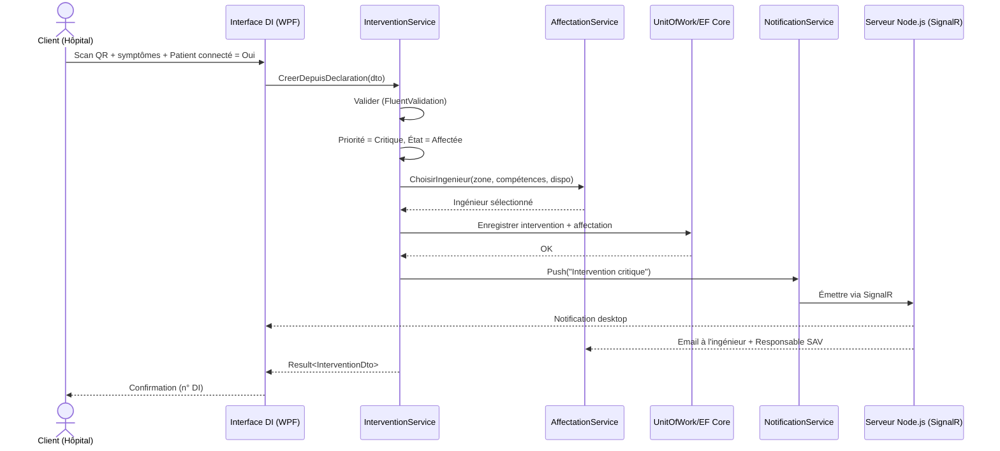
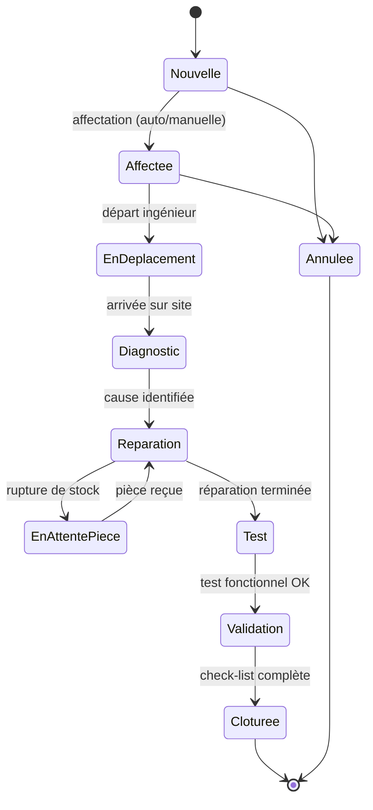
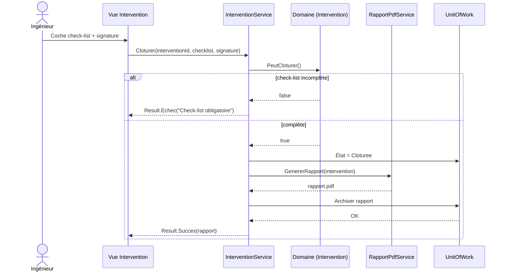

# Diagrammes UML — GMAO Datex-Ohmeda

> Diagrammes en notation Mermaid (rendus par GitHub/VS Code). Couvrent : cas d'utilisation, classes (domaine), séquence et états.

## 1. Diagramme de cas d'utilisation

## 1 bis. Cas d'utilisation détaillés — relations «include» / «extend»

> Cette section formalise le **contrôle d'accès action par action** (chaque cas métier inclut la
> vérification de permission) et les cas optionnels (extend). Les rôles et permissions sont ceux
> réellement définis dans `GMAO.Domain` (`RoleType`, `Permission`, `MatricePermissions`).
> Mermaid ne dispose pas d'un type « use case » natif : les relations sont représentées par des
> flèches pointillées explicitement étiquetées, complétées par le tableau ci-dessous.

### Relation «include» — vérification systématique de permission

Le cas **« S'authentifier / Vérifier la permission »** est **inclus** par tous les cas d'utilisation
métier : il matérialise l'appel, en tout début de chaque méthode de service, à
`IAutorisationService.AutoriserAsync(permission)`. La vérification revérifie l'identité en base
(compte existant et actif) puis consulte `MatricePermissions`. Un refus renvoie un `Result.Echec`
« Accès refusé » — jamais d'exception.

| Cas d'utilisation de base | Permission requise (incluse) | Service porteur |
|---|---|---|
| Créer une intervention | `CreerIntervention` | `InterventionService.CreerAsync` |
| Affecter une intervention | `AffecterIntervention` | `AffectationService.AffecterAsync` |
| Faire avancer le workflow | `ChangerEtatIntervention` | `InterventionService.ChangerEtatAsync` |
| Clôturer une intervention | `ClorerIntervention` | `InterventionService.ChangerEtatAsync` (état → Clôturée) |
| Générer le rapport PDF | `GenererRapport` | `RapportService.GenererRapportInterventionAsync` |
| Enregistrer un mouvement de stock | `GererStock` | `PieceService.EnregistrerMouvementAsync` |
| Gérer les utilisateurs | `GererUtilisateurs` | `UtilisateurService` (CRUD) |
| Consulter le tableau de bord | `ConsulterTableauBord` | `TableauBordService.ObtenirAsync` |

### Relation «extend» — cas optionnels conditionnels

| Cas d'extension | Étend le cas de base | Condition d'activation |
|---|---|---|
| Réaffecter à un autre ingénieur | Affecter une intervention | Ingénieur indisponible / changement de charge (exige aussi `AffecterIntervention`) |
| Filtrer / rechercher dans l'historique | Consulter l'historique des interventions | L'utilisateur saisit un critère de recherche |
| Afficher la vue globale du parc | Consulter le tableau de bord | Le rôle possède `ConsulterTableauBordGlobal` (responsable / administrateur) — sinon vue personnelle |

## 2. Diagramme de classes (domaine simplifié)

## 3. Diagramme de séquence — Déclaration critique (patient connecté)

## 4. Diagramme d'états — Intervention

## 5. Diagramme de séquence — Clôture avec check-list

